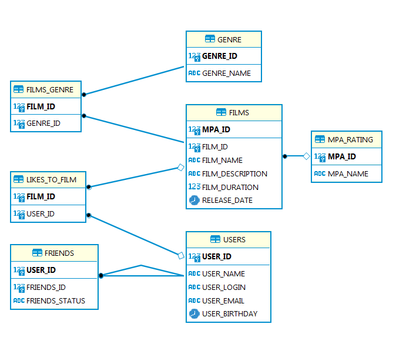

# java-filmorate
Template repository for Filmorate project.
## DB for filmorate-project.



### Вот несколько запросов к базе данных которые к ней можно сделать:

_Получить список друзей для пользователя с user_id = 1_

```
SELECT friends_id
FROM friends
WHERE user_id = 1 
AND friends_status LIKE 'confirmed';
```

_Получить список общих друзей для пользователей с user_id = 1 и User_ID = 2_

```
SELECT f.friends_id as common
FROM friends AS f
WHERE user_id = 2 
AND friends_status LIKE 'confirmed'
AND f.common IN (SELECT friends_id
                 FROM friends
                 WHERE user_id = 1);
```

_Получить кол-во лайков для фильма с film_id = 1_

```
SELECT COUNT(user_id)
FROM likes_to_film
WHERE film_id = 1;
```

_Получить ТОП 5 залайканных фильма_

```
SELECT film_id,
       COUNT(user_id) AS likes
FROM likes_to_film
GROUP BY film_id
ORDER BY likes DESC
LIMIT 5;
```
