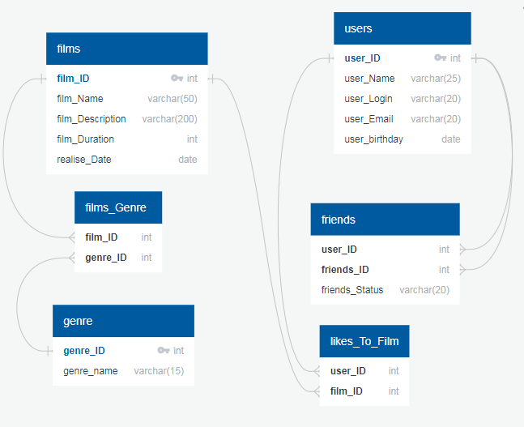

# java-filmorate

Template repository for Filmorate project.

## DB for filmorate-project.



### Вот несколько запросов к базе данных для понимания ее устройства:

_Получить список друзей для пользователя с User_ID = 1_

```
SELECT friends_ID
FROM friends
WHERE user_ID = 1 
AND friends_Status LIKE 'confirmed';
```

_Получить список общих друзей для пользователей с User_ID = 1 и User_ID = 2_

```
SELECT f.Friends_ID as common
FROM friends AS f
WHERE user_ID = 2 
AND friends_Status LIKE 'confirmed'
AND f.common IN (SELECT friends_ID
                 FROM friends
                 WHERE user_ID = 1);
```

_Получить кол-во лайков для фильма с Film_ID = 1_

```
SELECT COUNT(user_ID)
FROM likes_To_Film
WHERE film_ID = 1;
```

_Получить ТОП 5 залайканных фильма_

```
SELECT film_ID,
       COUNT(user_ID) AS likes
FROM likes_To_Film
GROUP BY film_ID
ORDER BY likes DESC
LIMIT 5;
```